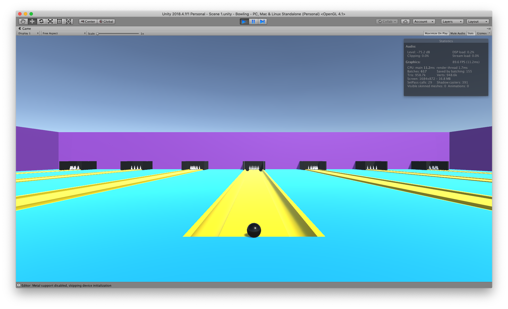

Bowling
=======

This is a simple bowling game I have created to introduce the
[Unity Game Engine](https://unity3d.com) to girls participating in the 2018
[AAUW Tech Savvy Conference](https://www.aauw.org/what-we-do/stem-education/tech-savvy/)
hosted at [Kentucky State University](http://www.kysu.edu),
where I teach computer science and video game development.

Going through the repository step by step as described in the instruction file,
this simple bowling game touches on the basics of Unity,
most notably physics using rigid bodies, kinematics, and prefabs.

I have subsequently expanded it to demonstrate importing models created with Fusion 360 for the 2018 [Verizon Foundation Innovative Learning](https://www.verizon.com/about/responsibility/verizon-innovative-learning) Summer Program,
also hosted at KSU.

Enjoy!
